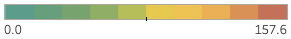
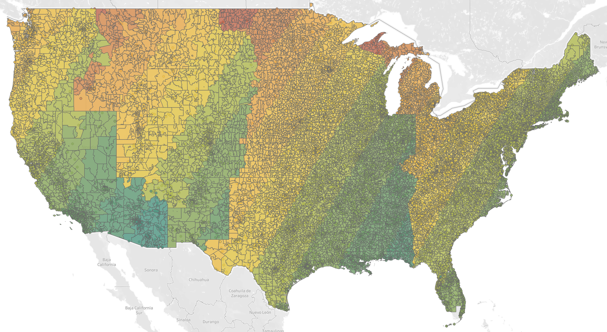
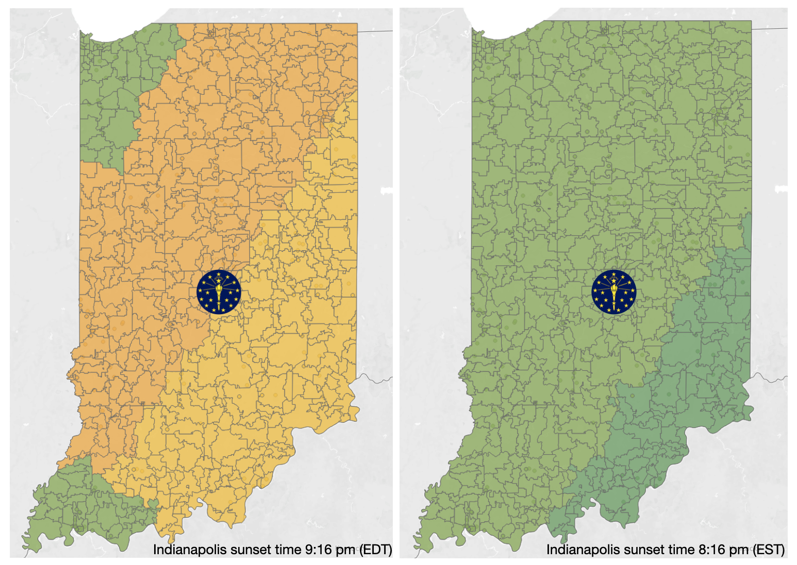

According to [sleepfoundation.org](https://www.sleepfoundation.org/sleep-news/removing-daylight-saving-time-changes-sleep), 63% of Americans support a national, permanent, year-round time. Daylight Savings Time (DST) delays sunset by an hour which influences circadian rhythms and may lead to insomnia or decreased sleep quality especially for persons who go to bed near the time of sunset.

In Indiana under Daylight Savings Time, sunset is after 9 pm during the summer months with daylight persisting past 10 pm. For a child who needs 9-10 hours of sleep this can have a major impact. For example, if the child needs to be awake at 8 am and that child needs 10 hours of sleep they should be in bed and asleep at 10 pm. In many areas of the US under daylight savings time, the sky is still bright at that time of day and our natural [circadian rhythm](https://www.sleepfoundation.org/circadian-rhythm) is interrupted.

The goal of this project is to provide a visual representation of the effect of DST on sunset times in Indiana in hopes that the state legislature will end the observance of daylight savings time in our state. Historically, Indiana did not observe daylight savings time until 2005 [under governor Mitch Daniels](https://www.wave3.com/story/3341011/daniels-signs-daylight-saving-time-into-law/). 

The images below represent a heat map of the continental US on summer solstice in 2023 (June 21st), the day of the year when sun is highest in the horizon in the northern hemisphere and the sunset is the latest.   

The time of sunset across the continental US on summer solstice varies by 157.6 minutes (*over 2 1/2 hours, normalized for local time*). The temperature scale for the heat map translates in to roughly 15 minutes for each progressive change in color.   

Note how the heat map below changes from green to orange at Indiana's western border for the counties in eastern time. The proximity of the state at the western edge of the time zone moves Hoosiers to some of the latest sunset times in the country. 

The next image represents a heat map of the continental US for the same date if Indiana were to stop observing daylight savings time in the eastern time zone counties. The image illustrates that the state would assume a more natural relationship between the time on the clock and the sun's position in the sky.

The side-by-side images below compare the current observance of daylight savings time (left) to standard time (right) for summer solstice 2023. It is this author's opinion that sunset at quarter past eight is better for sleep, stargazing, fireflies, and campfires!

----

For play-by-play of this project, see the [log](/DST/log.html) file.