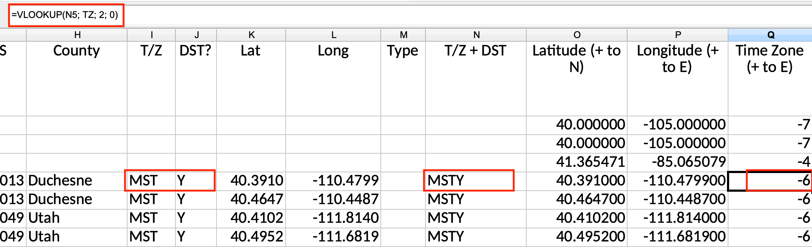
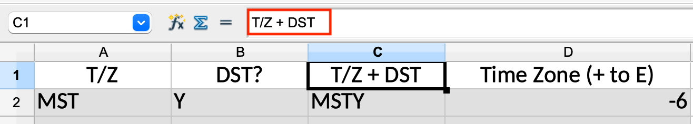
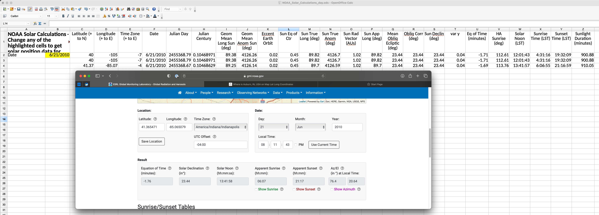

{::comment}
### Date in mm.dd.yy format
The stuff I'm going to say. Note the extra spaces at the end of this line to force a line break in GFM   
`tag1` `tag2`
{:/comment}

### NEXT
Read    
    * [Chloropleth Maps in Plotly](https://plotly.com/python/choropleth-maps/)
    * [Getting started with Plotly in Python](https://plotly.com/python/getting-started/)

* Build working demo
* Understand how source data may (or may not) be shared depending on licensing
* Publish site [Instructions](https://docs.github.com/en/pages/getting-started-with-github-pages/unpublishing-a-github-pages-site)      
`tag1` `tag2`

### SOON
* Publish and check URLs compared to page names. May need to update
* Review visualizations in R from Emma Foley @ IMO [Data Visualization A Practical Introduction by Kieran Healy](https://socviz.co/). Should be able to print to PDF
* Resource for [Making US maps in R](https://datavizpyr.com/how-to-make-us-state-and-county-level-maps-in-r/)
* Another one that does [counties with data from Tidyverse](https://www.geeksforgeeks.org/how-to-create-state-and-county-maps-easily-in-r/)
* One more: [Choropleth map with R](https://r-graph-gallery.com/choropleth-map-in-r.html)    
`tag1` `tag2`

### 9.24.23
* No progress on Sunshine Protection Act per [sleepfoundation.org](https://www.sleepfoundation.org/sleep-news/latest-updates-daylight-saving-time-legislation-change)
* [IANA.org](https://data.iana.org/time-zones/tz-link.html#web) may have the data I need for free
* Found a similar global project on [blog.poormansmat.net](https://blog.poormansmath.net/the-time-it-takes-to-change-the-time/)
* [erichurst@github](https://gist.github.com/erichurst/7882666) has created files of lat/long/zip code before from [US Census Gazeteer Files](https://www.census.gov/geographies/reference-files/time-series/geo/gazetteer-files.html). Contains [county](https://www.census.gov/geographies/reference-files/time-series/geo/gazetteer-files.html) data from US Census!!!
* [plotly](https://plotly.com/python/choropleth-maps/) looks promising for python base visualization

### 9.11.23
VLOOKUP created for Named Range to convert T/Z & DST? to concatenated string and numeric representation
* [VLOOKUP in OpenOffice](https://wiki.openoffice.org/wiki/Documentation/How_Tos/Calc:_VLOOKUP_function)
    * OpenOffice uses `semicolon space` between arguments in a function v a single `comma` in MS Excel
* [Using named ranges in OpenOffice](https://forum.openoffice.org/en/forum/viewtopic.php?t=2840)
    * Named Ranges can be `inserted` from the menu

### 9.9.23
NOAA Solar Calculations Workbook Modified:
* Moved Lat, Lon, TZ to rows
* Removed columns that are not direct dependencies of Sunrise & Sunset Time
* Confirmed correct calculation for local lat, lon, tz   

* Moved workbook to repo
* Changed [paste location in IDE](https://stackoverflow.com/questions/75831497/how-can-i-paste-images-into-my-markdown-files-in-vs-code)
* Downloaded [sample data](https://zipinfo.com/samples/z5llsam.txt) from zipinfo.com

### 9.9.23
First look at NOAA Solar Calculations workbook.

### 9.7.23
Log entries to keep track of project timeline. 

**Initial Tech Stack:** [VSCodium](https://vscodium.com), [Github pages](https://pages.github.com) running [Jekyll](https://jekyllrb.com) with [Just the Docs](https://just-the-docs.github.io/just-the-docs/) template, [OpenOffice](https://www.openoffice.org). May want to use [web.archive.org](https://web.archive.org) (aka "WaybackMachine") to ensure any research is available in the future when a page is changed or taken down.   

[NOAA](https://gml.noaa.gov/grad/solcalc/calcdetails.html) published some spreadsheets that calculate sunset times. Plan to review and see if formulae will work for large number of locations   
`Tech`