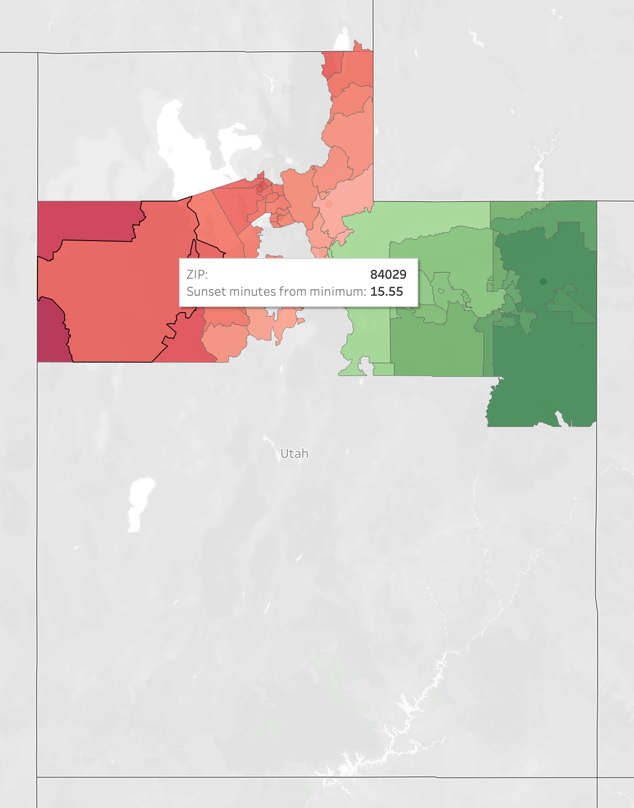

### 10.25.23
* Published to https://clobberx.github.io

### 10.25.23
* Full CONUS maps drafted and sent to state senator

### 10.22.23
* Revisit free options, need the following data points:
* City, State, Zip, Latitude, Longitude, Time Zone
* Free files from gazetteer do not contain time zone information
* Ordered ZIPList5 Geocode data from zipinfo.com 
* Tableau license obtained

### 10.15.23
* Sample data mapped in Tableau. Email sent to Senator Johnson.

### 10.8.23
* Started 14 day Tableau trial, downloaded desktop app
* [How to](https://kb.tableau.com/articles/howto/map-from-zip-codes)
* Sample data from Utah: Minimum sunset 20:48:55, Maximum 21:08:12, Roughly 19 minutes across state
* Formatting in cells from NOAA: H:MM:SS;@

### 9.25.23
* Still need a way to capture time zone from either zip code or lat/lon
* Cloned repo: git@github.com:eggert/tz.git - may not be entirely helpful
* Python app that takes lat/lon input: https://github.com/jannikmi/timezonefinder/blob/master/docs/0_getting_started.rst

### 9.24.23
* No progress on Sunshine Protection Act per [sleepfoundation.org](https://www.sleepfoundation.org/sleep-news/latest-updates-daylight-saving-time-legislation-change)
* [IANA.org](https://data.iana.org/time-zones/tz-link.html#web) may have the data I need for free
* Found a similar global project on [blog.poormansmat.net](https://blog.poormansmath.net/the-time-it-takes-to-change-the-time/)
* [erichurst@github](https://gist.github.com/erichurst/7882666) has created files of lat/long/zip code before from [US Census Gazeteer Files](https://www.census.gov/geographies/reference-files/time-series/geo/gazetteer-files.html). Contains [county](https://www.census.gov/geographies/reference-files/time-series/geo/gazetteer-files.html) data from US Census!!!
* [plotly](https://plotly.com/python/choropleth-maps/) looks promising for python base visualization

### 9.11.23
VLOOKUP created for Named Range to convert T/Z & DST? to concatenated string and numeric representation
* [VLOOKUP in OpenOffice](https://wiki.openoffice.org/wiki/Documentation/How_Tos/Calc:_VLOOKUP_function)
    * OpenOffice uses `semicolon space` between arguments in a function v a single `comma` in MS Excel
* [Using named ranges in OpenOffice](https://forum.openoffice.org/en/forum/viewtopic.php?t=2840)
    * Named Ranges can be `inserted` from the menu

### 9.9.23
NOAA Solar Calculations Workbook Modified:
* Moved Lat, Lon, TZ to rows
* Removed columns that are not direct dependencies of Sunrise & Sunset Time
* Confirmed correct calculation for local lat, lon, tz   

* Moved workbook to repo
* Changed [paste location in IDE](https://stackoverflow.com/questions/75831497/how-can-i-paste-images-into-my-markdown-files-in-vs-code)
* Downloaded [sample data](https://zipinfo.com/samples/z5llsam.txt) from zipinfo.com

### 9.9.23
First look at NOAA Solar Calculations workbook.

### 9.7.23
Log entries to keep track of project timeline. 

**Initial Tech Stack:** [VSCodium](https://vscodium.com), [Github pages](https://pages.github.com) running [Jekyll](https://jekyllrb.com) with [Just the Docs](https://just-the-docs.github.io/just-the-docs/) template, [OpenOffice](https://www.openoffice.org). May want to use [web.archive.org](https://web.archive.org) (aka "WaybackMachine") to ensure any research is available in the future when a page is changed or taken down.   

[NOAA](https://gml.noaa.gov/grad/solcalc/calcdetails.html) published some spreadsheets that calculate sunset times. Plan to review and see if formulae will work for large number of locations   
`Tech`